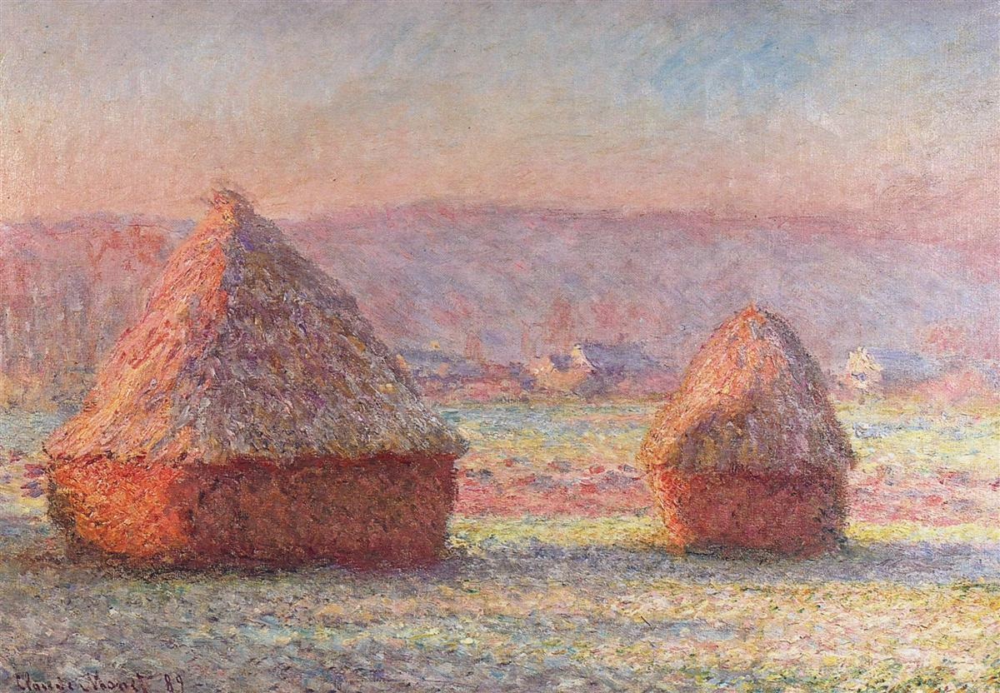
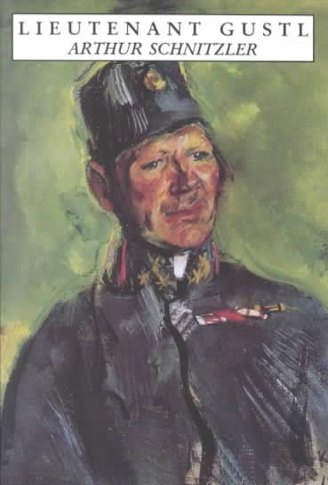
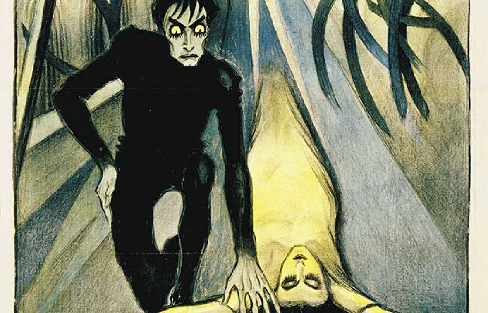

# Literatura alemana del cambio de siglo (*Jahrhundertwende*)

## Literatura finisecular y sus vanguardias. El Expresionismo.

1. Introducción

La Jahrhundertwende está marcada por un creciente enfrentamiento entre los intereses de Alemania y Austria-Hungría, traducido en una progresiva militarización y modificación de las estructuras económicas. 
En cuanto al pensamiento, Nietzsche y Schopenhauer dejan su impronta en la ideología y actitud finiseculares, caracterizadas por el decadentismo, el clima de crisis o los nuevos enfoques científicos de acercamiento a la realidad.

2. Las vanguardias.

{width=50%}\centering

En el contexto literario, se acentúa la tendencia a la heterogeneidad propia del siglo XIX surgiendo una proliferación de corrientes antagónicas y simultáneas. El término *Die Moderne* (1880-1920) acoge a estas vanguardias vigentes entre la publicación del Manifiesto Vanguardista (1909) y 1920: Impresionismo, Simbolismo, Futurismo, Dadaísmo, Surrealismo, etc. contrarias a un arte reproductivo como era el Naturalismo. El expresionismo tendrá especial relevancia e influencia en la literatura y otras artes. 

Los movimientos vanguardistas, con su componente subjetivista, esteticista y formalista que los emparenta con el Romanticismo, renuevan el lenguaje y lo cuestionan como "materia prima" de la literatura.

Al igual que sucede en otros países en la literatura de principios de siglo se comienza a jugar con nuevas formas narrativas entre las que destaca el monólogo interior. En lengua alemana uno de los primeros escritores que comienzan a utilizar este estilo rompedor relacionado con el Impresionismo es Arthur Schnitzler, que en su obra *Leutenant Gustl* (1901) refleja de forma desordenada todos los pensamientos que atraviesan la mente del protagonista en el transcurso de una sola noche. 

{width=30%}\centering

Por otra parte, afines al Simbolismo serán el visionario Stefan George y Hugo von Hofmannsthal, que harán del "arte por el arte", su programa. El primero fundó en Munich la revista *Blätter fur kunst* (1892). 

Los grandes narradores de la decadencia finisecular serán, entre otros: Heinrich y Thomas Mann y Robert Musil. El primero escribió *Professor Unrat* (1905) y *Der Untertan* (1916), para denunciar la sociedad guillermina del II Reich. En *La muerte en Venecia* (1912) retrata el conflicto entre artista y vida. 

3. Expresionismo (1910-1920)

{width=50%}\centering

El Expresionismo es un movimiento transmediático que concibe el arte como universo de símbolos desde el punto de vista interno del artista. En el cine podemos verlo en las películas de Murnau y Fritz Lang. En pintura encontramos los grupos *Der blaue Reiter* (Múnich) y *Die Brücke* (Berlín).La edición de revistas como *Der Sturm* y *Die Aktion* es donde podemos ver otras manifestaciones del Expresionismo. 

Los expresionistas critican la moral acomodaticia de su entorno y perciben la amenaza de la técnica, el militarismo y la guerra, reflejada en visiones apocalípticas y de destrucción, que se convierten en temática recurrente. Ante la ausencia de salidas queda sólo el anhelo de destrucción como alternativa y promesa de surgimiento de algo nuevo y mejor. Respecto a las otras  vanguardias  percibimos  en  el  arteexpresionista  un  claro  cambio  de  paradigma: la ruptura con la estética de «lo bonito» y realce de lo feo y sórdido. El arte deja de ser correlato perfecto de una realidad imperfecta.  

La poesía lírica expresionista indaga en la estética de lo feo, lo torcido, lo deforme y explora los ámbitos de la metrópoli y la locura. Junto a un Expresionismo mesiánico, como el de Johannes R. Becher, existe otro de corte apocalíptico, con imágenes de destrucción y muerte (Georg Heym, Georg Trakl y Gottfried Benn).  

El teatro apuesta por un nuevo lenguaje escénico que nos retrotrae al Stationendrama barroco, dominio de la gestualidad, personajes alegóricos y estereotipados, efectos visuales y de sonido. Sus representantes son Georg Kaiser, Die Bürger von Calais (1914) y Ernst Toller, quien participó en la proclamación de la República bolchevique de Múnich en 1918 y es autor, entre otras obras, de Massemensch (1921). 

La obra del checo Franz Kafka, publicada tras su muerte, articula la indefensión y la enajenación del ser humano en un mundo que lo aniquila (Lukacs definiría «Roman» como «Ausdruck der transzendentalen Obdachlosigkeit»). Todo ello vertebra la temática de Die Verwandlung (1915), Das Urteil (1913), Der Prozess (1914‐15, publicada en 1925) o In der Strafkolonie (1919). 

