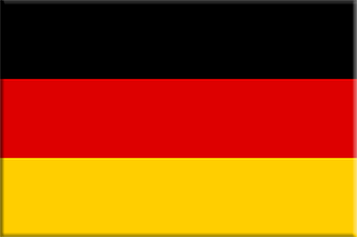
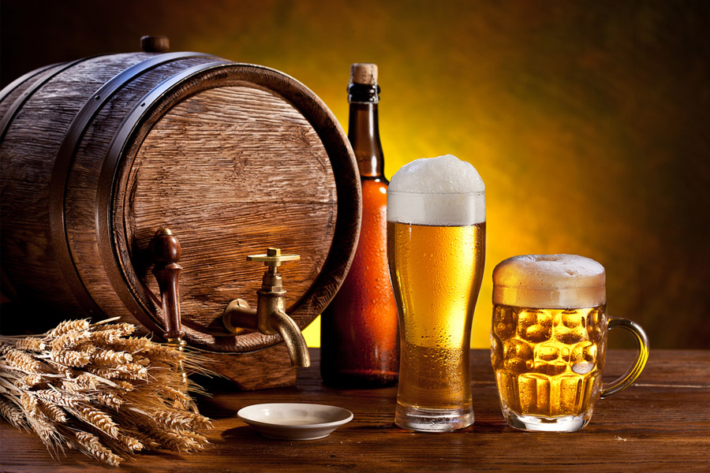

## Contenido

\tableofcontents

# Alemán I

## ¡Vamos allá!

\centering

{ width=50% }

## ¿Por qué aprender alemán?

* La economía alemana es una de las más importantes del mundo

* La tasa de desempleo en Alemania es, a día de hoy, inferior a un 6%

* Su relativa dificultad lo convierte en un reto muy interesante

* Es un idioma muy diferente al español

## Hallo! Wie geht's?

- Lo más importante a la hora de empezar cualquier conversación es el saludo y la despedida.

- En esta primera lección vamos a estructurar una conversación
    - *a modo de caja, cuya tapa es el saludo y la base es la despedida.*

- Después aprenderemos algunas frases y verbos para poder llenar esa caja.

# ¡Hola! ¿Qué tal?

## Algunas expresiones para empezar

**Expresión**                                      **Traducción**                                 
-------                                            ------                                 
Hallo!                                             ¡Hola!
Ich heiße Günter                                    Me llamo Günter        
Wie geht’s (dir)?                                  ¿Qué tal?                
Mir geht’s (sehr) gut                              ¡Estoy (muy) bien!
Und dir?                                           ¿Y tú?
Mir geht’s auch gut, danke!                        ¡Yo bien también, gracias!
¡Tschüss! / Bis spät!                              ¡Adiós! / ¡Hasta luego!                             
    

## ¿Pero cómo se pronuncia?

A continuación  puedes ver la pronunciación aproximada de las expresiones que acabas de aprender. En algunos casos coincide, pero en otros servirá para que te entiendan más o menos. Está bien para empezar, ¿no?

**Expresión**                      **Traducción**    
---------------                    ----------
Hallo!                             [jalo] 
Ich heiße Günter                   [ij jaise Gunta]
Wie geht’s (dir)?                  [fi guets (día)?]
Mir geht’s (sehr) gut              [mía guets (sea) gut] 
Und dir?                           [unt día?]
Mir geht’s auch gut, danke!        [mía guets auj gut, danke] 
¡Tschüss! / Bis spät!              [chus!/bis sh-pet!]   
\centering

## A mí me va...

- En realidad para preguntar cómo está alguien en alemán se pregunta cómo le va y, por tanto, la respuesta literal no *es yo bien también*, sino *a mí también bien*.
- La forma *geht’s* de la pregunta *wie geht’s dir?* se compone de las palabras *geht* (va) + *es* (ello) = **geht’s**.
- Puede que te suene la expresión **auf Wiedersehen** (adiós). Se trata de una despedida en contextos formales. Con amigos mejor usar **tschüss!**.

\centering
	
## Yo me llamo, tú te llamas...

Ahora pasemos a una parte fundamental de cualquier idioma: los **pronombres**.

**Alemán**                                           **Español**                                 
-------                                              ------                                 
ich                                                   yo
du                                                    tú        
er/sie/es                                             él/ella/ello                
wir                                                   nosotros/as
ihr                                                   vosotros/as
sie / Sie                                             ellos/as - usted/es
 

# Algunos sustantivos

## Los géneros

En alemán existen 3 géneros distintos para los sustantivos:

   - Masculino: *der*
   - Femenino: *die*
   - Neutro: *das*

## ¿Género neutro?
- Hay que tener en cuenta que:

     1. El género neutro, como ya sabrás, no existe en español
     2. En un principio, puede resultar sorprendente que palabras como “niño” y “niña” tengan género neutro
     3. A cada uno de los géneros le corresponde su pronombre. La correspondencia para **das** es el pronombre **es**

\centering

## El hombre, la mujer, el niño...
- el hombre - der Mann
- la mujer - die Frau
- el niño - das Kind
- la niña - das Mächden
- la cerveza - das Bier (también neutro)

## Para ilustrar...

[Haz clic aquí](http://www.guiadealemania.com/cerveza-en-alemania/) si quieres descubrir la magia de la cerveza alemana.

## Ten en cuenta...

- Los sustantivos en alemán llevan siempre la primera letra en mayúscula
- El artículo para el plural coincide con el de femenino *die*
- El plural de los sustantivos no sigue una regla fija (*der Mann - die Männer / das Kind - die Kinder*)
- Es *MUY* importante que cuando aprendas un nuevo sustantivo intentes memorizar su género, pues no coinciden todos con los del español (*tomate*, en alemán, es femenino)

\centering
